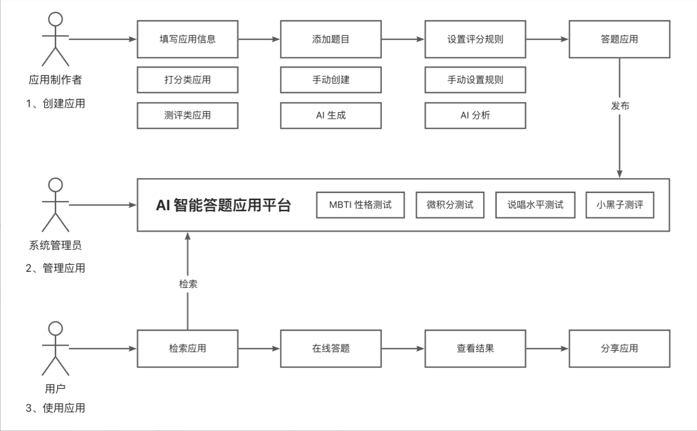
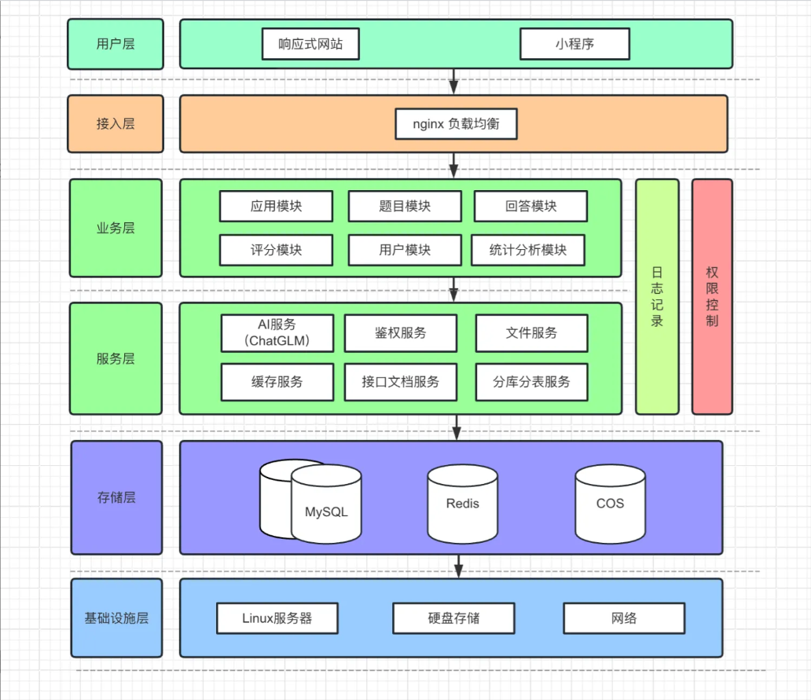

# AI问卷平台

## 项目介绍

  本平台用户可以使用AI生成并发布对应需求的问卷，支持检索和分享问卷，在线收集并基于评分算法或者AI分析问卷，管理员可以审核问卷，集中管理站内内容并进行统计分析。

## 架构设计

### 1. 核心业务流程图

### 2. 架构设计图

## 技术选型

* SpringBoot 快速开发

* 存储层： Mysql数据库 + Redis缓存 + 腾讯云COS对象存储

* Mybaits-PLus 以及Mybatis X 自动生成

* Caffeine 本地缓存

* Ression 分布式锁

* ChatGLM大模型AI能力

* RxJava 响应式框架  + 线程池隔离

* SSE 服务端推送

* ShardingSphere 分库分表

* 幂等设计 +  分布式ID雪花算法

  