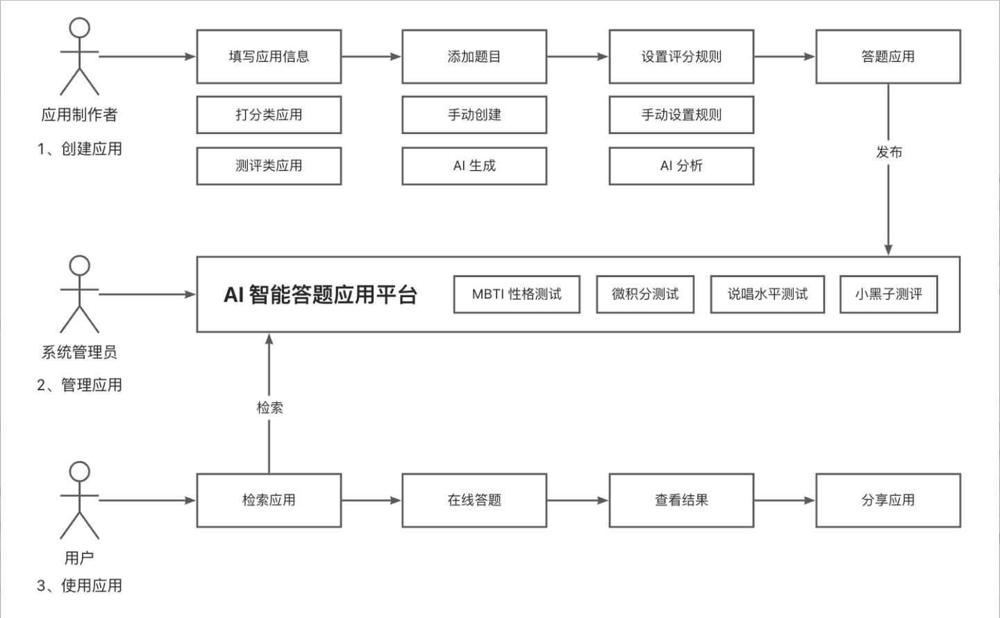

# 环境准备

java 8

mysql   8

redis  6

springboot 2.7


# 平台后端开发

主要包括

* 需求分析
* 库表设计
* 后端项目初始化
* 后端基础开发 - 增删改查
* 后端核心业务流程开发


## 一 需求分析

明确要做的需求，并且设置优先级，从而明确开发计划

### 项目功能梳理

* 用户模块
  * 注册
  * 登录
  * 管理用户-增删改查 [管理员]
* 问卷模块
  * 创建问卷
  * 修改问卷
  * 删除问卷
  * 查看问卷列表
  * 查看问卷详情
  * 查看自己创建的问卷
  * 管理问卷 - 增删改查【管理员】
  * 审核发布与下架问卷【管理员】
  * 分享问卷（扫码查看）
* 问卷题目模块
  * 创建题目 （包括题目得分设置）
  * 修改题目
  * 删除题目
  * 管理题目- 增删改查[管理员]
  * AI生成题目
* 评分模块
  * 创建评分结果
  * 修改评分结果
  * 删除评分结果
  * 根据回答计算评分结果（多种评分策略）
    * 自定义规则评分 - 测评类
    * 自定义规则评分 - 打分类
    * AI 评分
  * 管理评分结果 - 增删改查【管理员】
* 填写问卷模块
  * 提交回答
  * 查看回答
* 统计分析模块
  * 查看结果


### 核心业务流程




### 需求优先级

* 用户模块
  * 注册 P0
  * 登录 P0
  * 管理用户-增删改查 [管理员] P1
* 问卷模块
  * 创建问卷 P0
  * 修改问卷 P1
  * 删除问卷 P1
  * 查看问卷列表 P0
  * 查看问卷详情 P0
  * 查看自己创建的问卷 P1
  * 管理问卷 - 增删改查【管理员】 P0
  * 审核发布与下架问卷【管理员】 P0
  * 分享问卷（扫码查看） P2
* 问卷题目模块
  * 创建题目 （包括题目得分设置） P0
  * 修改题目 P1
  * 删除题目 P1
  * 管理题目- 增删改查[管理员] P1
  * AI生成题目 P1
* 评分模块
  * 创建评分结果 P0
  * 修改评分结果 P1
  * 删除评分结果 P1
  * 根据回答计算评分结果（多种评分策略）
    * 自定义规则评分 - 测评类 P0
    * 自定义规则评分 - 打分类 P0
    * AI 评分 P1
  * 管理评分结果 - 增删改查【管理员】 P1
* 填写问卷模块
  * 提交回答 P0
  * 查看回答 P0
* 统计分析模块
  * 查看结果 P2


## 二 库表设计


### 用户表

```sql
-- 用户表
create table if not exists user
(
    id           bigint auto_increment comment 'id' primary key,
    userAccount  varchar(256)                           not null comment '账号',
    userPassword varchar(512)                           not null comment '密码',
    unionId      varchar(256)                           null comment '微信开放平台id',
    mpOpenId     varchar(256)                           null comment '公众号openId',
    userName     varchar(256)                           null comment '用户昵称',
    userAvatar   varchar(1024)                          null comment '用户头像',
    userProfile  varchar(512)                           null comment '用户简介',
    userRole     varchar(256) default 'user'            not null comment '用户角色：user/admin/ban',
    createTime   datetime     default CURRENT_TIMESTAMP not null comment '创建时间',
    updateTime   datetime     default CURRENT_TIMESTAMP not null on update CURRENT_TIMESTAMP comment '更新时间',
    isDelete     tinyint      default 0                 not null comment '是否删除',
    index idx_unionId (unionId)
) comment '用户' collate = utf8mb4_unicode_ci;

```


### 问卷表

```sql
-- 应用表
create table if not exists app
(
    id              bigint auto_increment comment 'id' primary key,
    appName         varchar(128)                       not null comment '应用名',
    appDesc         varchar(2048)                      null comment '应用描述',
    appIcon         varchar(1024)                      null comment '应用图标',
    appType         tinyint  default 0                 not null comment '应用类型（0-得分类，1-测评类）',
    scoringStrategy tinyint  default 0                 not null comment '评分策略（0-自定义，1-AI）',
    reviewStatus    int      default 0                 not null comment '审核状态：0-待审核, 1-通过, 2-拒绝',
    reviewMessage   varchar(512)                       null comment '审核信息',
    reviewerId      bigint                             null comment '审核人 id',
    reviewTime      datetime                           null comment '审核时间',
    userId          bigint                             not null comment '创建用户 id',
    createTime      datetime default CURRENT_TIMESTAMP not null comment '创建时间',
    updateTime      datetime default CURRENT_TIMESTAMP not null on update CURRENT_TIMESTAMP comment '更新时间',
    isDelete        tinyint  default 0                 not null comment '是否删除',
    index idx_appName (appName)
) comment '应用' collate = utf8mb4_unicode_ci;

```

审核字段

```sql
   reviewStatus    int      default 0                 not null comment '审核状态：0-待审核, 1-通过, 2-拒绝',
    reviewMessage   varchar(512)                       null comment '审核信息',
    reviewerId      bigint                             null comment '审核人 id',
    reviewTime      datetime                           null comment '审核时间'
```


### 问卷题目表

```sql
-- 题目表
create table if not exists question
(
    id              bigint auto_increment comment 'id' primary key,
    questionContent text                               null comment '题目内容（json格式）',
    appId           bigint                             not null comment '应用 id',
    userId          bigint                             not null comment '创建用户 id',
    createTime      datetime default CURRENT_TIMESTAMP not null comment '创建时间',
    updateTime      datetime default CURRENT_TIMESTAMP not null on update CURRENT_TIMESTAMP comment '更新时间',
    isDelete        tinyint  default 0                 not null comment '是否删除',
    index idx_appId (appId)
) comment '题目' collate = utf8mb4_unicode_ci;

```

questionContent 的结构

```json
[
  {
    "options": [
      {
        "result": "I", // 如果是测评类，则用 reslut 来保存答案属性
        "score": 1,    // 如果是得分类，则用 score 来设置本题分数
        "value": "A选项", //选项内容
        "key": "A"   //选项 key
      },
      {
        "result": "E", // 如果是测评类，则用 reslut 来保存答案属性
        "score": 0,
        "value": "B选项",
        "key": "B"
      }
    ],
    "title": "题目"
  }
]

```

### 测评结果表

用户提交问卷后，会获得回答的评定，如ISTJ之类

```sql
-- 评分结果表
create table if not exists scoring_result
(
    id               bigint auto_increment comment 'id' primary key,
    resultName       varchar(128)                       not null comment '结果名称，如物流师',
    resultDesc       text                               null comment '结果描述',
    resultPicture    varchar(1024)                      null comment '结果图片',
    resultProp       varchar(128)                       null comment '结果属性集合 JSON，如 [I,S,T,J]',
    resultScoreRange int                                null comment '结果得分范围，如 80，表示 80及以上的分数命中此结果',
    appId            bigint                             not null comment '应用 id',
    userId           bigint                             not null comment '创建用户 id',
    createTime       datetime default CURRENT_TIMESTAMP not null comment '创建时间',
    updateTime       datetime default CURRENT_TIMESTAMP not null on update CURRENT_TIMESTAMP comment '更新时间',
    isDelete         tinyint  default 0                 not null comment '是否删除',
    index idx_appId (appId)
) comment '评分结果' collate = utf8mb4_unicode_ci;

```

不同测测评类型使用不同的字段，测评类型用resultProp 得分类型用resultScoreRange.


### 用户问卷记录

```sql
-- 用户答题记录表
create table if not exists user_answer
(
    id              bigint auto_increment primary key,
    appId           bigint                             not null comment '应用 id',
    appType         tinyint  default 0                 not null comment '应用类型（0-得分类，1-角色测评类）',
    scoringStrategy tinyint  default 0                 not null comment '评分策略（0-自定义，1-AI）',
    choices         text                               null comment '用户答案（JSON 数组）',
    resultId        bigint                             null comment '评分结果 id',
    resultName      varchar(128)                       null comment '结果名称，如物流师',
    resultDesc      text                               null comment '结果描述',
    resultPicture   varchar(1024)                      null comment '结果图标',
    resultScore     int                                null comment '得分',
    userId          bigint                             not null comment '用户 id',
    createTime      datetime default CURRENT_TIMESTAMP not null comment '创建时间',
    updateTime      datetime default CURRENT_TIMESTAMP not null on update CURRENT_TIMESTAMP comment '更新时间',
    isDelete        tinyint  default 0                 not null comment '是否删除',
    index idx_appId (appId),
    index idx_userId (userId)
) comment '用户答题记录' collate = utf8mb4_unicode_ci;

```

